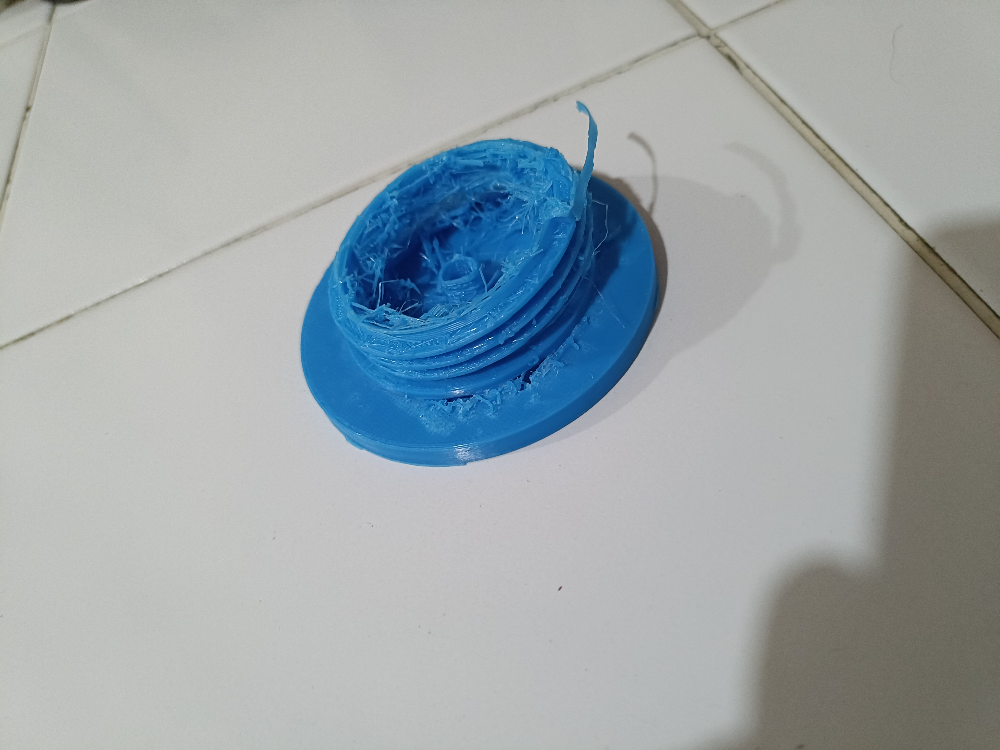
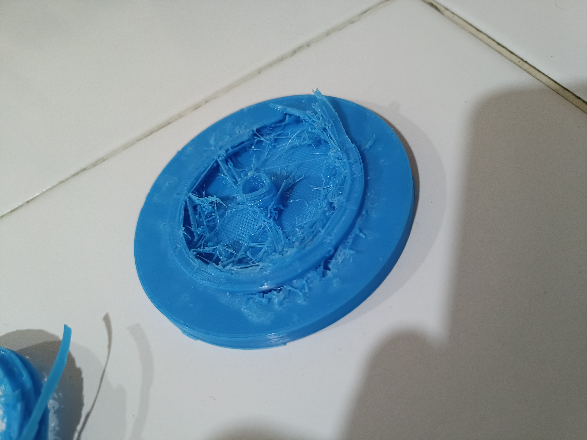
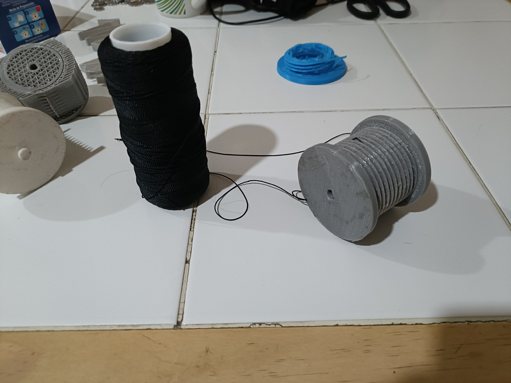
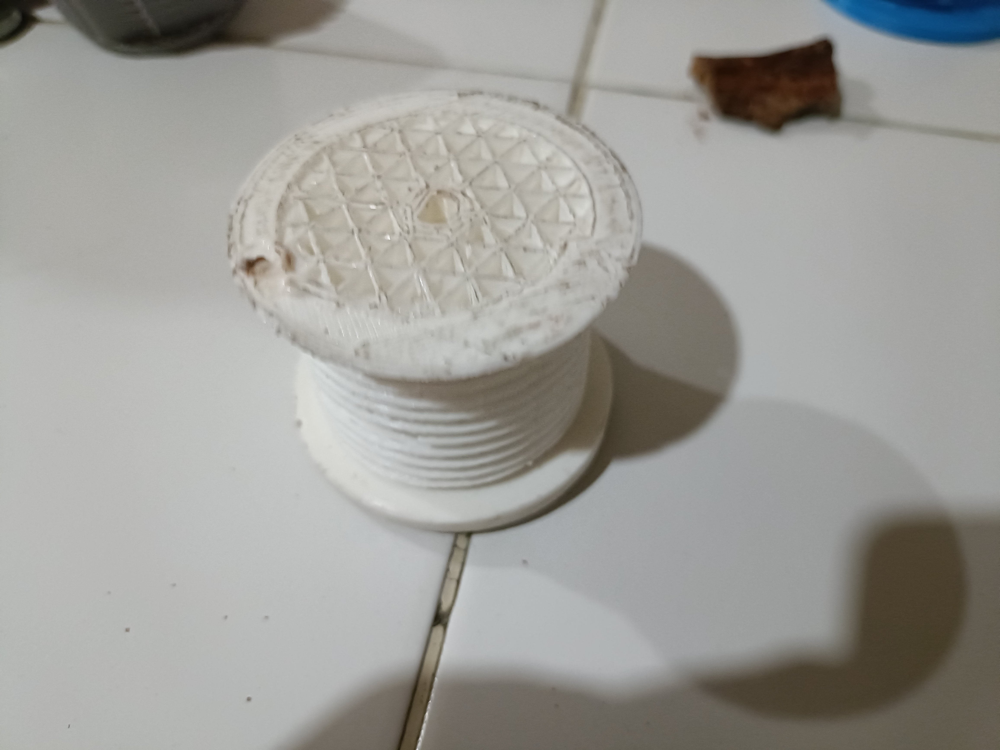
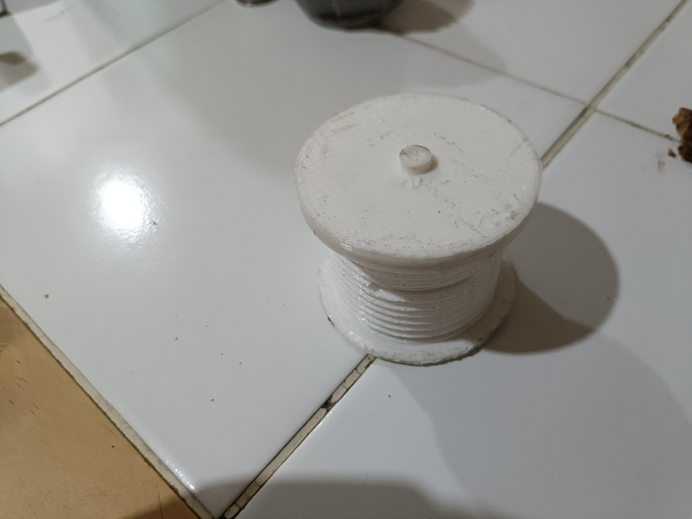
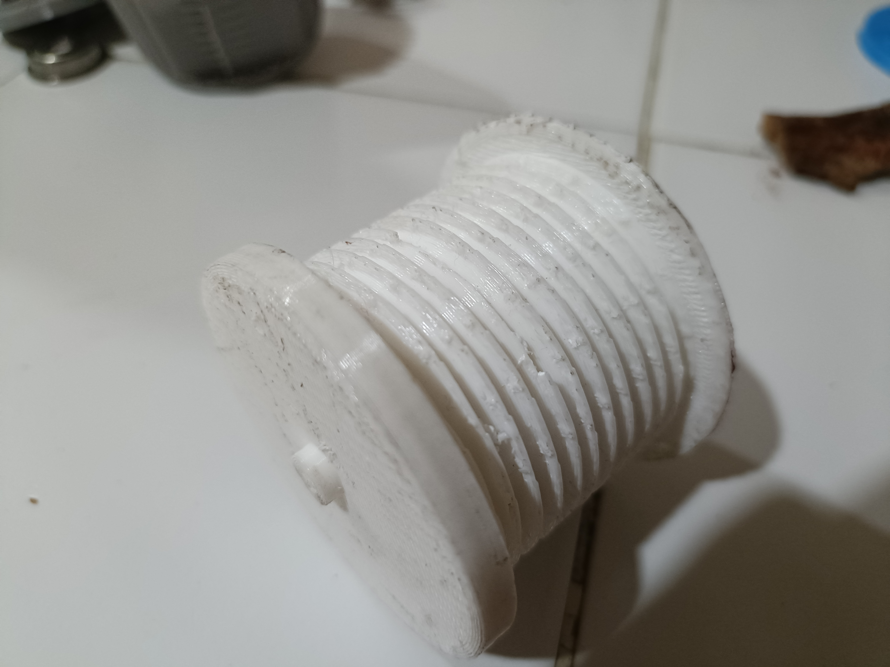
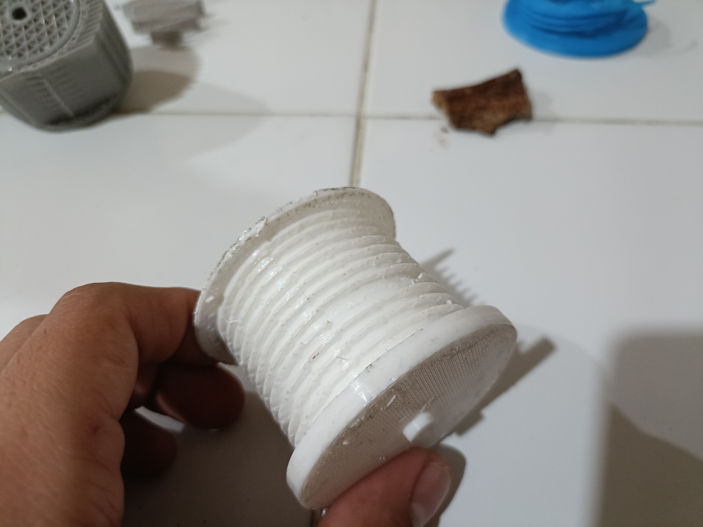
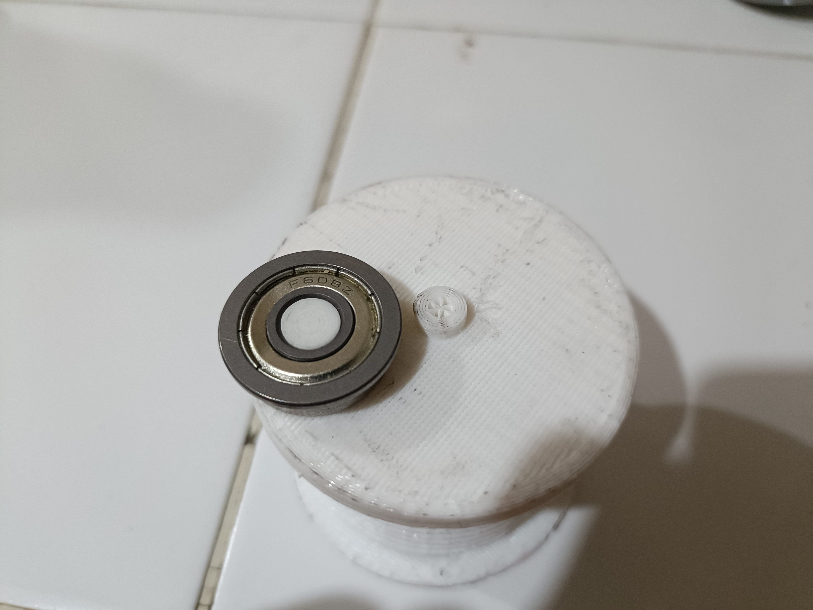
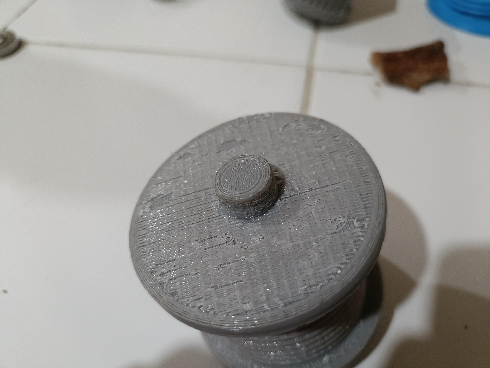
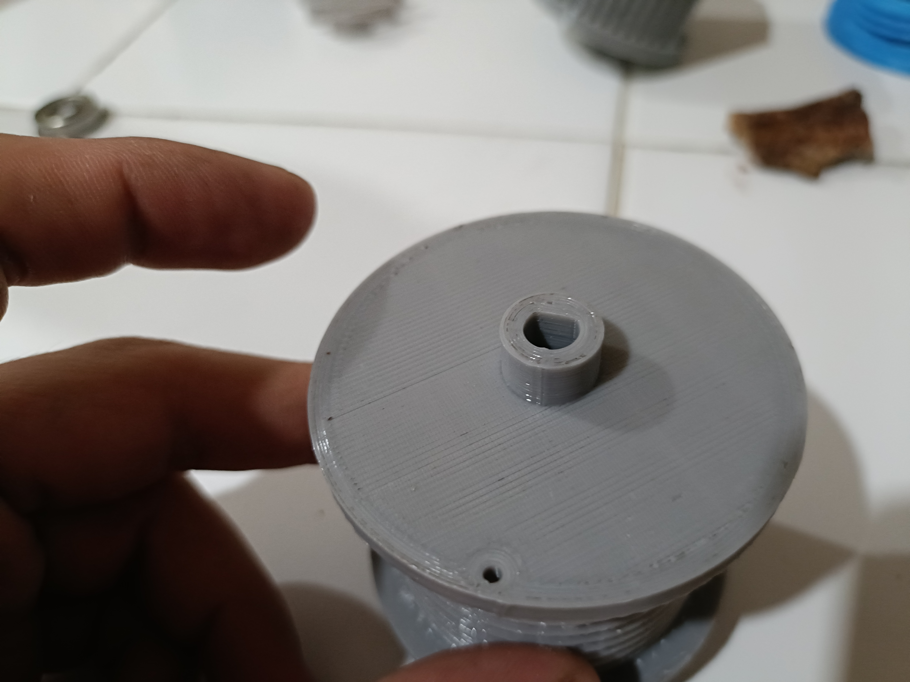

# Proyecto_Paralelos
En este repositorio de administrarán los proyectos y sus respectivos programas relacionados con el desarrollo e implementación de robots paralelos por cables.

- [Objetivo](#objetivo)
- [Metas](#metas)
- [Participantes](#participantes)
- [Referencias](#referencias)

## Objetivo

Implementar un robot paralelo dirigido por cables para que este pueda realizar tareas de sensado y manipulación de materiales.

## Metas

- [ ] Implementar el actuador de los cables del robot*
- [ ] Diseñar la estructura y el cuerpo del robot para su implementación en la estructura del espacio de trabajo del tercer piso.

## Participantes

**Integrantes del proyecto:**

| Nombre | Observaciones | Semestre |
| :----------| :----------- | :----------- |
| M.I. Erik Peña Medina | **Responsable** | ---- 
| Braughton Portas Ricardo Alastair | **Participante** | 2024-2 |

## Referencias

### ¿Dónde empezar?

1. **Cable-Driven Parallel Robots**[Libro](https://link.springer.com/content/pdf/10.1007/978-3-319-76138-1.pdf).
2. **Open-Source Planar Cable-Driven Robot**[Repositorio](https://github.com/LionelBirglen/OpenSourcePlanarCableRobot/tree/main)
3. **Modelling and Implementation of Cable Driven Parallel Manipulator System with Tension Control** [Repositorio](https://github.com/siddharthumakarthikeyan/Cable-Driven-Parallel-Robots-CDPR-Modelling)
4. **Accuracy of large-scale cable-driven parallel robot with universal joint pulleys**[Articulo](https://hal.science/hal-03393239/)
5. **Cable Driven Parallel Robot**[Video](https://www.youtube.com/watch?v=cxKAWujUV-c)
6. **Digital design of a сable-driven parallel robot**[Articulo](https://iopscience.iop.org/article/10.1088/1757-899X/945/1/012085/pdf)
7. **A Deployable Cable-Driven Parallel Robot With Large Rotational Capabilities for Laser-Scanning Applications**[Articulo](https://ieeexplore.ieee.org/abstract/document/9076279)
8. **Kinematics of the wire-driven parallel robot MARIONET using linear actuators**[Articulo](https://ieeexplore.ieee.org/abstract/document/4543803)
9. **A Review of Cable-Driven Parallel Robots: Typical Configurations, Analysis Techniques, and Control Methods**[Articulo](https://ieeexplore.ieee.org/abstract/document/9745192)
10. **Design and Development of a New Cable-Driven Parallel Robot for Waist Rehabilitation**[Articulo](https://ieeexplore.ieee.org/abstract/document/8716563)
11. **Design and implementation of a cable-driven parallel robot for additive manufacturing applications**[Articulo](https://www.sciencedirect.com/science/article/abs/pii/S0957415822000964)
## Introducción
El presente proyecto tiene por objetivo el diseño, implementación y control de un robot paralelo controlado por cables para ser instalado en el tercer piso del Centro de Ingeniería Avanzada en la facultad de Ingeniería.
## Etapas de desarrollo
Este proyecto constara de las siguientes etapas de desarrollo las cuales se realizarán de manera secuencial:
1. Diseño y construcción del actuador encargado de la variación de longitud de los cables.
2. Diseño y construcción de la estructura necesaria para soportar el actuador .
3. Implementación del método de control del actuador 
...
## 1. Diseño y constrcción del actuador
Para el diseño del actuador, tras analizar los mecanismos existentes actualmente se optó por un tornillo sin fin el cual cumpla la función de un carrete para el cable conectado directamente a la flecha de un motor pololou GB37-100.  
En esta etapa se realizaron múltiples iteraciones con la finalidad de refinar el diseño.

- **Primera iteración**  
En esta iteración se imprimió el modelo con un relleno de 10% y un espesor de pared de .8mm lo cual hizo que la pieza fuera altamente frágil por lo cual ni siquiera se concluyó la impresión, sin embargo con la parte impresa al retirar los soportes la pieza fracturó reafirmando la observación sobre su fragilidad.

- **Segunda iteración**  
Para la segunda iteración se incrementó el relleno a un 20% y el espesor de pared a 2mm lo cual generó una pieza exitosa, sin embargo, con esta impresión nos percatamos de que el diseño del carrete no contaba con ninguna clase de soporte, por lo cual, de ser implementado las cargas normales producirían daños en la flecha del motor. Por otro lado, el barreno de la pieza que se diseñó para sostener el hilo se cerró debido a que se diseñó con un grosor muy reducido si embargo este se re-abrió fácilmente con la ayuda de una aguja caliente.

- **Tercera iteracion**  
En esta ocasión, tras los errores observados en la impresión pasada, se decidió colocar el carrete sobre un eje acoplado con un balero 608Z.  
Al momento de imprimir esta pieza con los mismos parámetros de impresión de las piezas anteriores, la pieza fallo debido a un corte en el suministro de luz, dejando la pieza a un 80% por lo cual la pieza no fue útil sin embargo se realizaron pruebas de ajuste del eje con el balero, pero al intentar colocar el balero el eje se rompió evidenciando que el diámetro del eje era insuficiente.

- **Cuarta iteración**  
Para esta iteración se seleccionaron baleros 6201z en los cuales el diámetro interior es un 150% mayor, además se modificaron los archivos de impresión de modo que, aunque la pieza conservaba los parámetros anteriores, en los ejes se aumentó el relleno a un 100% a fin de aumentar la resistencia mecánica. Por desgracia en el proceso de aumentar la densidad se cometió un error en las propiedades de los modelos auxiliares utilizados para modificar la densidad de la pieza haciendo que el eje no fuera impreso correctamente.  
Del mismo modo con base en las iteraciones previas se observó que el espesor de la cuerda del tornillo sin fin era insuficiente lo cual causaba que al retirar los soportes era muy propensa a dañarse o incluso fracturarse, razón por la cual se incrementó el paso de la cuerda.
  
- **Quinta iteración**  
Esta iteración volvió a ser incompleta, aunque en esta ocasión se desconoce el motivo, sin embargo, tras un análisis de las partes que si se imprimieron completas, se pudo ver que era necesaria una revisión de las tolerancias en los ejes ya que no presentaban un ajuste adecuado.

- **Sexta iteración**
Esta fue la ultima iteracion realizada ya que esta ya cuenta con el ajuste de tolerancias y geometria necesaria para el proyecto, los archivos de esta pieza se pueden encontrar en la carpeta de nombre CAD en este mismo repositorio.

